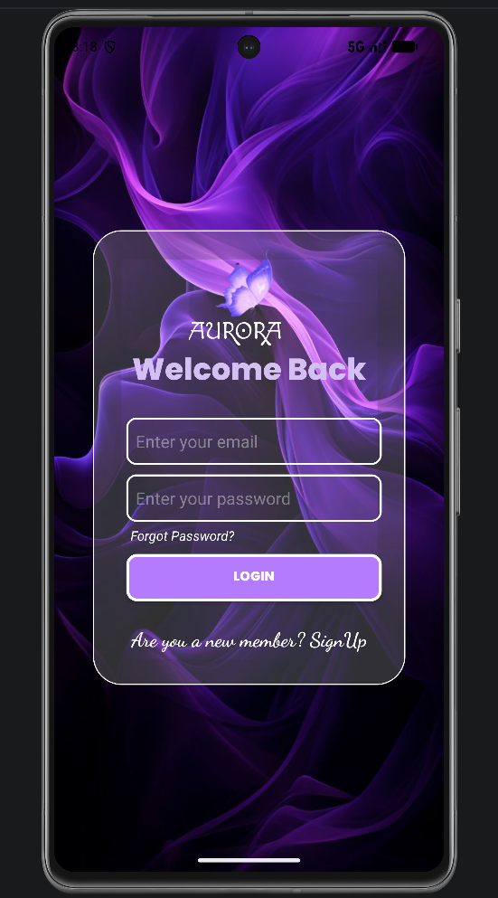

<div align="center">


<br/>

A modern Android login screen built with **Kotlin** and **XML**, featuring a glassmorphism-inspired interface and a refined purple gradient aesthetic. Aurora is designed to demonstrate clean UI architecture, thoughtful visual design, and production-ready layout practices using native Android tooling.

<br/>


<br/><br/>


<br/><br/>


</div>

<br/>

<div align="center">
  
</div>

<br/>

---

## Overview

Aurora reimagines the standard login experience with a soft, frosted-glass aesthetic layered over a purple gradient backdrop. Every element — from input fields to buttons — is built using native `ConstraintLayout` for a fully responsive, pixel-accurate design across screen sizes, without relying on third-party UI libraries.

### Table of Contents

- [Features](#features)
- [Tech Stack](#tech-stack)
- [Project Structure](#project-structure)
- [Getting Started](#getting-started)
- [Preview](#preview)
- [Roadmap](#roadmap)
- [Contributing](#contributing)
- [Author](#author)
- [License](#license)

---

## Features

<table>
<tr>
<td width="50%">

**Design**
- Modern glassmorphism-inspired interface
- Purple gradient visual theme
- Polished, professional aesthetic

</td>
<td width="50%">

**Functionality**
- Fully responsive `ConstraintLayout` design
- Email and password input fields
- Forgot Password entry point
- Sign Up prompt for new users

</td>
</tr>
</table>

---

## Tech Stack

| Category    | Technology         |
|-------------|---------------------|
| Language    | Kotlin               |
| UI          | XML                  |
| IDE         | Android Studio        |
| Layout      | ConstraintLayout      |
| Min SDK     | 24+                    |

---

## Project Structure

```
Aurora/
│
├── app/                    # Application source code and resources
├── gradle/                 # Gradle wrapper files
├── screenshots/
│   └── login_ui.png        # UI preview image
├── build.gradle.kts        # Project-level build configuration
├── settings.gradle.kts     # Project settings
├── gradlew                 # Gradle wrapper (Unix)
├── gradlew.bat              # Gradle wrapper (Windows)
└── README.md
```

---

## Getting Started

### Prerequisites

- Android Studio (latest stable version recommended)
- Android SDK 24 or higher
- An emulator or physical Android device

### Installation

1. Clone the repository
   ```bash
   git clone https://github.com/h-hibaaah/Aurora.git
   ```
2. Open the project in **Android Studio**.
3. Let Gradle sync automatically.
4. Build and run the app on an emulator or connected device.

---

## Preview

To showcase the UI, place a screenshot of the login screen inside the `screenshots/` folder and name it:

```
login_ui.png
```

---

## Contributing

Contributions, issues, and feature requests are welcome. Feel free to check the [issues page](https://github.com/h-hibaaah/Aurora/issues) if you'd like to contribute.

---

## Author

**Hibba**
GitHub: [@h-hibaaah](https://github.com/h-hibaaah)

---

## License

This project is available under the MIT License. See the `LICENSE` file for details.

---

<p align="center">If you found this project useful, consider giving it a star on GitHub.</p>


